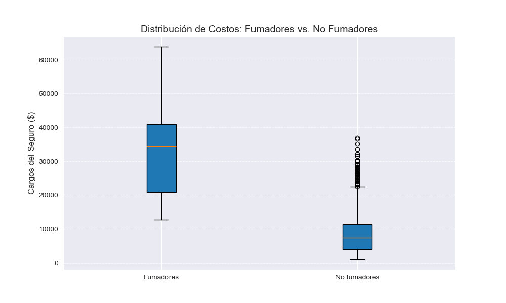

# Análisis Exploratorio de Costos de Seguros Médicos de Estados Unidos

  

## Descripción del Proyecto

Este proyecto consiste en un **Análisis Exploratorio de Datos (EDA)** detallado sobre un conjunto de datos de seguros médicos. El objetivo principal es simular el rol de un Analista de Datos para una compañía aseguradora, buscando identificar los patrones y variables demográficas que tienen el mayor impacto financiero en la facturación de primas.

A diferencia de un análisis superficial, este proyecto se centra en descubrir **interacciones entre variables** (como la relación entre Obesidad y Tabaquismo) para ofrecer recomendaciones estratégicas sobre la segmentación de riesgos.

## Preguntas de Negocio (Objetivos)

El análisis se diseñó para responder cuatro interrogantes clave para la estrategia de precios de la aseguradora:

1.  **Tabaquismo:** ¿Qué tan drástica es la diferencia de costos entre asegurados fumadores y no fumadores?
2.  **Edad y Progresión:** ¿El costo aumenta linealmente con la edad o existen bandas de riesgo ocultas?
3.  **Salud (BMI):** ¿Es la obesidad por sí sola un predictor de altos costos, o depende de otros factores?
4.  **Geografía:** ¿Por qué ciertas regiones (como el Sureste) tienen cargos promedio más altos?

## Hallazgos Principales (Key Insights)

Tras el análisis estadístico y visual, se llegaron a las siguientes conclusiones de negocio:

### 1. El Tabaquismo es el Factor Dominante
Fumar es el mayor predictor de costos. Los asegurados que fuman tienen un costo promedio de **$32,050**, casi **4 veces mayor** que los no fumadores ($8,434). Además, la volatilidad de costos (riesgo financiero) es mucho mayor en este grupo.



### 2. La Interacción BMI-Tabaquismo (El "Efecto Multiplicador")
Uno de los hallazgos más críticos del proyecto fue identificar que el Índice de Masa Corporal (BMI) no afecta a todos por igual:
* En **No Fumadores**, el BMI tiene una correlación casi nula con el costo ($R \approx 0.08$).
* En **Fumadores**, el BMI se convierte en un multiplicador de riesgo masivo, con una correlación lineal muy fuerte ($R \approx 0.81$).
* **Conclusión:** La obesidad es financieramente crítica *principalmente* cuando se combina con el tabaquismo.


### 3. Justificación de Disparidades Regionales
Se descubrió que la región **Southeast** es la más costosa. Sin embargo, el análisis de descomposición reveló que esto no se debe a la ubicación geográfica, sino a la demografía de sus habitantes:
* El Sureste tiene la mayor tasa de fumadores (**25%** vs ~18% en otras zonas).
* También presenta el BMI promedio más alto (**33.36**).

### 4. Anomalía en Familias Numerosas (Subsidios)
El análisis de la variable `children` mostró una tendencia no lineal. Los costos suben con 1, 2 y 3 hijos, pero **caen significativamente** para familias con 4 o 5 hijos. Esto sugiere la existencia de subsidios gubernamentales o políticas de descuentos por volumen que la aseguradora debería auditar.


---

## 🛠Herramientas y Tecnologías

* **Python 3.13:** Lenguaje principal.
* **Pandas:** Manipulación y limpieza de datos, agregaciones y estadística descriptiva.
* **Matplotlib:** Generación de visualizaciones estáticas para el reporte.
* **NumPy:** Cálculos numéricos y manejo de arrays.

## Estructura del Repositorio

```text
├── 01_Notebooks/             <- Código fuente
├── 02_Data/                  <- Dataset original (insurance.csv)
├── Visualizaciones/          <- Gráficos exportados en PNG
└── README.md                 <- Resumen del proyecto